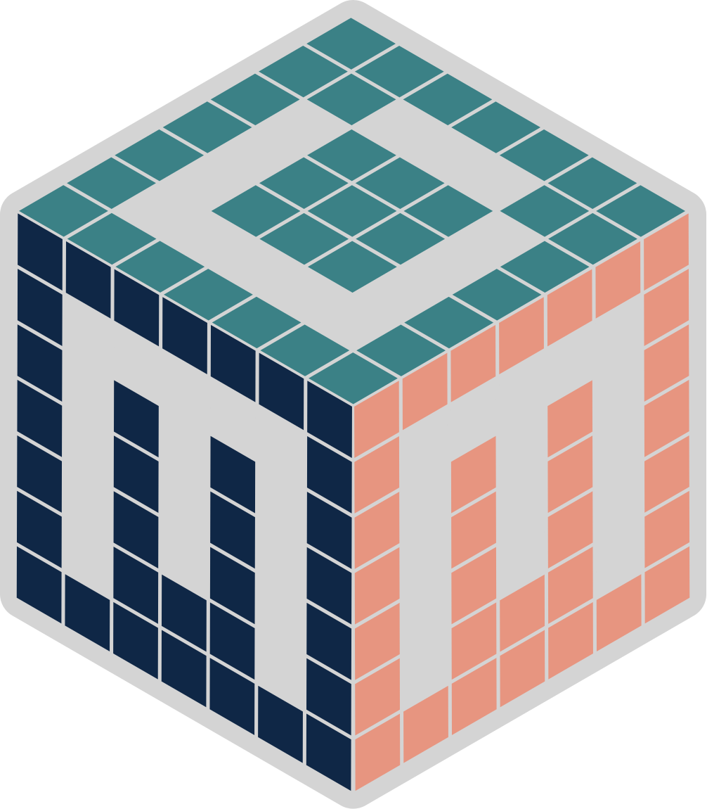
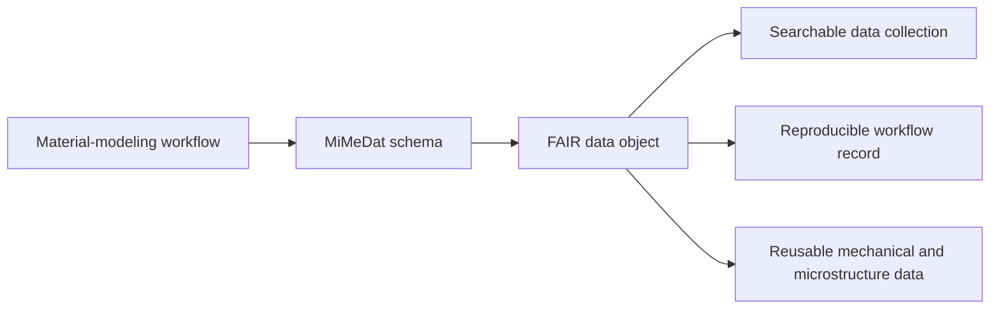
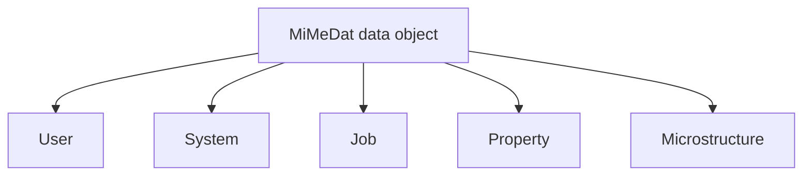
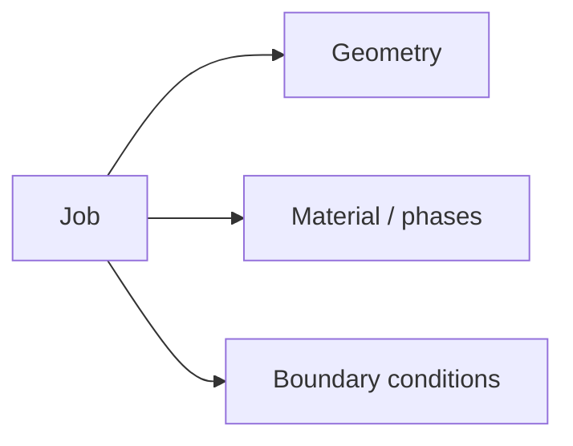
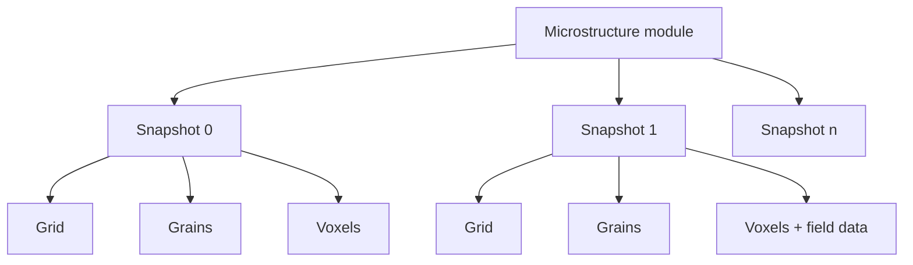

# MiMeDat Schema

<p align="center">
  
</p>

<h3 align="center">
MiMeDat (Microstructure & Mechanical Data): A Modular, Workflow-Centric, Code-Agnostic Schema for FAIR Data Objects
</h3>

<p align="center">
  <em>A modular metadata schema for describing, validating, exchanging, and reusing microstructure-sensitive mechanical data across material-modeling workflows.</em>
</p>

<p align="center">
  
</p>
---

# MiMeDat (Microstructure & Mechanical Data): A Modular, Workflow-Centric, Code-Agnostic Schema for FAIR Data Objects

**A modular metadata schema for describing, validating, exchanging, and reusing microstructure-sensitive mechanical data across material-modeling workflows.**

</div>

---

## 1. What is MiMeDat?

**MiMeDat** stands for **Microstructure & Mechanical Data**.

It is a **JSON-based**, **modular**, **workflow-centric**, and **code-agnostic** schema for representing FAIR data objects generated in microstructure-sensitive mechanical workflows.

The schema describes:

- who created the data,
- where and how the data were generated,
- which material system and simulation setup were used,
- which mechanical or thermal boundary conditions were applied,
- which properties were computed or extracted,
- and, where available, how the microstructure is represented.

The goal is to make a data object interpretable outside the software environment that generated it.

---

## 2. Problem MiMeDat solves

MiMeDat addresses a **data-infrastructure problem** in microstructure-sensitive materials mechanics. Mechanical properties depend strongly on microstructure and thermo-mechanical history, but the data needed to describe this relation are often sparse, expensive to generate, and difficult to reuse without consistent metadata.

The schema does not prescribe one specific workflow or require several simulation tools. Instead, it provides a common structure for turning any well-defined material-modeling workflow into a FAIR data object. This object combines the scientific result with the context needed to interpret, validate, search, and reuse it.



| Data-infrastructure challenge | What MiMeDat provides |
|---|---|
| Sparse microstructure-sensitive mechanical datasets | A structured way to generate reusable simulation-derived data objects. |
| Metadata separated from numerical results | One schema object combining user, system, job, property, and microstructure information. |
| Weak reproducibility context | Explicit recording of software, system, geometry, material model, boundary conditions, and units. |
| Inconsistent data organization | A modular JSON schema with validation rules and controlled structure. |
| Difficult search and reuse | FAIR-oriented metadata fields that make purpose-specific datasets easier to collect and compare. |
| Limited extensibility | Separate modules that can be refined or extended, including a dedicated microstructure module. |

In this sense, MiMeDat is best understood as a **FAIR representation layer** for microstructure-sensitive mechanical data: it makes workflow-generated data objects structured, identifiable, and reusable beyond the local script, solver input file, or project folder in which they were created.

---

## 3. Schema architecture

A MiMeDat data object is organized into five main modules.



Each module has a specific role. Together, they describe one complete workflow-generated data object.

---

## 4. Module overview

### User module

The **User** module records identity, authorship, ownership, access, rights, and relation metadata.

| Content | Purpose |
|---|---|
| Identifier | Gives the data object a unique reference. |
| Title | Provides a human-readable name for the object. |
| Creator and affiliation | Records authorship and institutional context. |
| Rights and rights holder | Defines ownership and reuse conditions. |
| Shared-with information | Supports controlled access and sharing. |
| Relation metadata | Links the object to related objects or resources. |

Relation metadata can be used to describe how one data object is connected to another, for example when a downstream simulation starts from a state generated by an upstream workflow stage.

---

### System module

The **System** module records the computational environment used to generate the data.

| Content | Purpose |
|---|---|
| Software name | Identifies the tool or workflow component. |
| Software version | Supports reproducibility. |
| Operating system | Documents the execution environment. |
| System version | Records platform details. |
| Processor specifications | Captures computational hardware context. |
| Input and result paths | Connects the schema object to workflow files. |

This module records which software produced the data without making the schema dependent on that software.

---

### Job module

The **Job** module defines what was simulated and how.



| Submodule | Description |
|---|---|
| Geometry | RVE size, discretization, continuity, and origin. |
| Material / phases | Phase information, constitutive models, orientations, and material parameters. |
| Boundary conditions | Mechanical and thermal loading information. |

The boundary-condition representation can describe finite-element-style constraints, such as loads or displacements applied to faces, edges, or vertices. It can also represent macroscopic loading cases used by spectral or FFT-based solvers, where loading is prescribed at the level of the full representative volume element.

---

### Property module

The **Property** module stores the mechanical response extracted from simulation output or post-processing.

| Content | Purpose |
|---|---|
| Stress | Stores mechanical response measures. |
| Strain | Stores deformation response measures. |
| Plastic strain or other quantities | Supports optional derived quantities. |
| Units | Makes numerical values interpretable and reusable. |

The property module is intended for homogenized or post-processed quantities associated with the workflow-generated data object.

---

### Microstructure module

The **Microstructure** module stores microstructure-related information. In the extended MiMeDat representation, it can describe microstructure as an ordered sequence of states or snapshots.



A snapshot may contain:

| Level | Example content |
|---|---|
| Grid | Grid status, size, and spacing. |
| Grain | Grain ID, phase ID, orientation, and grain volume. |
| Voxel | Voxel ID, grain ID, phase ID, position, and orientation. |
| Field data | Stress, strain, deformation gradient, or additional state variables. |

Detailed documentation of the microstructure module is maintained in the dedicated microstructure-module repository.

---

## 5. Minimal JSON skeleton

A simplified MiMeDat object follows this high-level structure.

```json
{
  "user": {
    "identifier": "unique_data_object_id",
    "title": "Example MiMeDat data object",
    "creator": "Name",
    "creator_affiliation": "Institution",
    "rights": "License",
    "rights_holder": "Owner"
  },

  "system": {
    "software": "Simulation or workflow tool",
    "software_version": "version",
    "system": "operating system",
    "system_version": "version",
    "processor_specifications": "processor information",
    "input_path": "path/to/input",
    "results_path": "path/to/results"
  },

  "job": {
    "geometry": {
      "RVE_size": [1.0, 1.0, 1.0],
      "RVE_continuity": true,
      "discretization_type": "structured",
      "discretization_unit_size": [0.015625, 0.015625, 0.015625],
      "discretization_count": [64, 64, 64]
    },
    "material": {
      "phases": [],
      "constitutive_model": {},
      "orientation": []
    },
    "boundary_conditions": {
      "mechanical_BC": [],
      "thermal_BC": []
    }
  },

  "property": {
    "stress": {},
    "strain": {},
    "units": {}
  },

  "microstructure": [
    {
      "id": "snapshot_id",
      "time": 0.0,
      "grid": {},
      "grains": [],
      "voxels": []
    }
  ]
}
```

This skeleton is only an orientation map. The full schema defines the required fields, allowed types, controlled values, and validation rules.

---

## 6. Resources, citation, and contact

### Schema resources

- Main metadata schema:  
  [microstructure_sensitive_mechanical_metadata_schema.json](https://github.com/Ronakshoghi/MetadataSchema/blob/main/microstructure_sensitive_mechanical_metadata_schema.json)

- Microstructure module:  
  [Microstructure_Module.json](https://github.com/YousefRezek/MicrostructureEvolutionDataSchema/blob/main/Microstructure_Module.json)

### Related publications

- Ronak Shoghi and Alexander Hartmaier,  
  *A Workflow-Centric Approach to Generating FAIR Data Objects for Computationally Generated Microstructure-Sensitive Mechanical Data*,  
  Advanced Engineering Materials, 2025.  
  https://doi.org/10.1002/adem.202401876

- Yousef Rezek, Ronak Shoghi, Alexander Hartmaier,  
  *MiMeDat: A Modular, Workflow-Centric, Code-Agnostic Schema for FAIR Data Objects Capturing Microstructure Evolution and Mechanical Data in Multi-Tool Processing–Structure–Properties Workflows.*

### Authors

- Ronak Shoghi
- Yousef Rezek
- Alexander Hartmaier

**Organization:** ICAMS, Ruhr University Bochum, Germany

**Contact:**

- ronak.shoghi@rub.de
- yousef.rezek@rub.de
